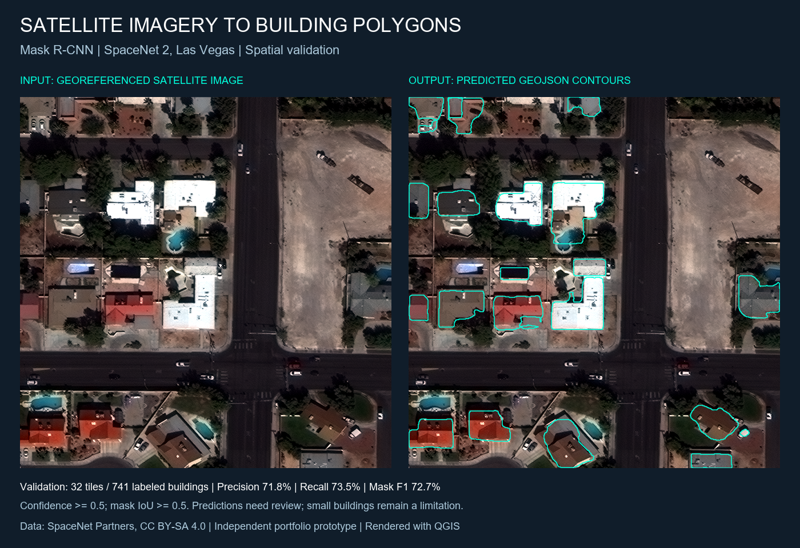
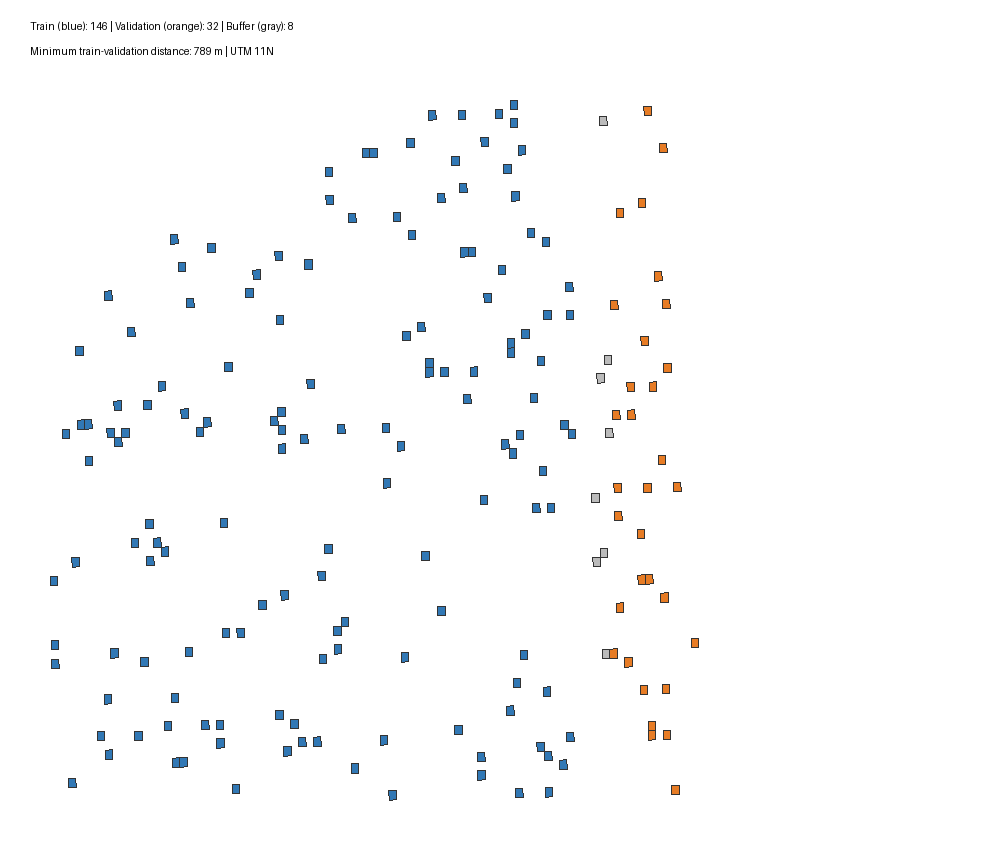

# Satellite Building Footprint Extraction

**Mask R-CNN · SpaceNet 2 · Spatial validation · GeoJSON · QGIS**

An independent geospatial machine learning portfolio project: prepare satellite
imagery and building labels, fine-tune an instance segmentation model, evaluate
it in a geographically separated area, and convert predicted masks into GIS polygons.



## Results

The experiment used 146 training tiles (4,118 buildings) and 32 validation tiles
(741 buildings) from Las Vegas. The minimum distance between the two sets is
788.95 m. Training used 1,500 iterations with a batch size of 2.

| Validation metric | Result |
|---|---:|
| Precision | 71.81% |
| Recall | 73.55% |
| Mask F1 | 72.67% |
| Mask AP50, 0–100 scale | 75.78 |
| Mask AP, 0–100 scale | 46.36 |

Precision/recall/F1 use confidence >=0.5 and mask IoU >=0.5 with one-to-one matching.
There were 545 true positives, 214 false positives and 196 false negatives.
This mask F1 is not the official SpaceNet polygon score. COCO evaluation uses
up to 100 predictions per image. [Recorded metrics](results/experiment02/validation_metrics.json).

## Browse the deliverables

- [Training and spatial validation notebook](notebooks/02_mask_rcnn_spatial_validation.ipynb)
- [Predicted GeoJSON](portfolio/exports/buildings_vegas_validation.geojson): 759 instances,
  with confidence, source tile and projected area in m². Coordinates are WGS84 longitude/latitude.
- [QGIS project](portfolio/SpaceNet_portfolio.qgz): four sample rasters and the full prediction layer.
- [Error analysis](docs/ERROR_ANALYSIS.md)
- [Portfolio description](portfolio/UPWORK_PROJECT.md)

Download or clone the repository before opening the QGIS project. Keep the
`portfolio/data` and `portfolio/exports` folders alongside the project file.
The saved view opens at the first validation example. Other predicted tiles have
no imagery included here; only four GeoTIFF examples are distributed.

## Pipeline

1. Select 200 image/label pairs from the complete 3,850-tile RGB catalog using a
   fixed SHA256 ordering. The committed manifest freezes the selected object keys.
2. Exclude 14 tiles with incomplete coverage. The RGB-zero rule is dataset-specific.
3. Convert GeoJSON building labels to per-instance COCO masks, preserving holes
   and disconnected parts. Use per-band 2–98 percentile normalization for RGB PNGs.
4. Separate the eastern region for validation. Exclude 8 more tiles near a 250 m
   buffer; verify distances between tile footprints in UTM 11N.
5. Fine-tune Mask R-CNN R50-FPN in Colab from COCO pretrained weights.
6. Evaluate, inspect errors, and vectorize predicted masks without simplification.



## Reproduce locally

Use a Conda environment for the CPU geospatial tools:

```bash
conda env create -f environment.yml
conda activate spacenet-gis
```

The environment file specifies dependencies; it is not a lockfile. Data preparation
was originally run with Python 3.12 and the GDAL tools bundled with QGIS 3.44.
The original Colab package lock and model weights are not included, so bit-for-bit
retraining is not claimed. A fresh Conda solve has not been tested here.

### Export the included predictions — no GPU or full dataset required

```bash
python scripts/export_predictions_geojson.py --output outputs/buildings.geojson
```

The script reads the committed COCO predictions and georeferencing report. It
checks geometry validity, area and exact mask reconstruction for each instance.
An adjacent `.verification.json` report is written. No cross-tile merging or
deduplication is performed. This is a GIS conversion check, not model validation.

### Rebuild the training package

Run from the repository root:

```bash
python scripts/download_experiment.py --download
python scripts/prepare_experiment.py
python scripts/verify_experiment.py
```

The frozen 200-pair selection downloads about 484 MiB of RGB rasters plus labels.
Preparation creates `outputs/spacenet_experiment_02.zip` (about 138 MiB). Raw data,
processed training files, model weights and generated ZIPs are intentionally ignored by Git.

Open notebook 02 in [Google Colab](https://colab.research.google.com/), enable a GPU,
and run its cells in order. In cell 3, upload the generated ZIP using the file picker.
Do not paste a local computer path into notebook code. GPU availability is controlled
by Colab. Download the report and model ZIPs before closing the temporary runtime.
The notebooks are written in Spanish for the original learning workflow.

Notebook 01 is the earlier 8-image smoke test. For that optional experiment:

```bash
python scripts/download_sample.py --count 10 --download
python scripts/prepare_coco.py
python scripts/build_colab_bundle.py
```

### Reproduce the error analysis after preparing the data

```bash
python scripts/analyze_validation.py results/experiment02/coco_instances_results.json
```

## What was verified

- 4,859 training/validation masks: dimensions, area, bounding boxes and RLE reconstruction.
- No train/validation image overlap and a measured 788.95 m minimum geographic gap.
- 759 exported geometries: valid shapes and exact mask-to-polygon-to-mask round trips.
- QGIS project re-opened successfully with all five layers valid.
- The fixed-confidence analysis reproduces the submitted TP/FP/FN counts exactly.

Verification records are under `results/experiment02` and `portfolio/exports`.
Notebook code is included without execution outputs. Results were supplied from
the completed Colab run and retained as separate artifacts.

## Limitations and next experiment

Small buildings remain the main weakness: recall is 34.96%, versus 94.91% for
medium and 69.77% for large masks. Of 196 missed objects, 160 are small. Some
large roofs are split or have inaccurate boundaries. Predictions require review.

This is a public-data prototype, not a client commission or production deployment.
The source data was already labeled. The GIS export uses the existing validation
predictions; inference on unrelated new customer imagery has not been demonstrated.
Validation is within Las Vegas and used for development, not a final independent test.

The next proposed experiment compares inference at 650 and 1,024 pixels using
the same checkpoint and thresholds. It has not been run, and no improvement is claimed.

## Data attribution and reuse

SpaceNet 2 / SpaceNet Partners, [dataset page](https://spacenet.ai/spacenet-buildings-dataset-v2/),
[CC BY-SA 4.0](https://creativecommons.org/licenses/by-sa/4.0/).
Van Etten, A., Lindenbaum, D., & Bacastow, T.M. (2018), *SpaceNet: A Remote Sensing
Dataset and Challenge Series*, arXiv:1807.01232.

Included rasters, labels, predicted geometry and derivative figures retain this
attribution. See [DATA_ATTRIBUTION.md](DATA_ATTRIBUTION.md). Dataset licensing is
distinct from software licensing; no software license has been assigned in this package.
