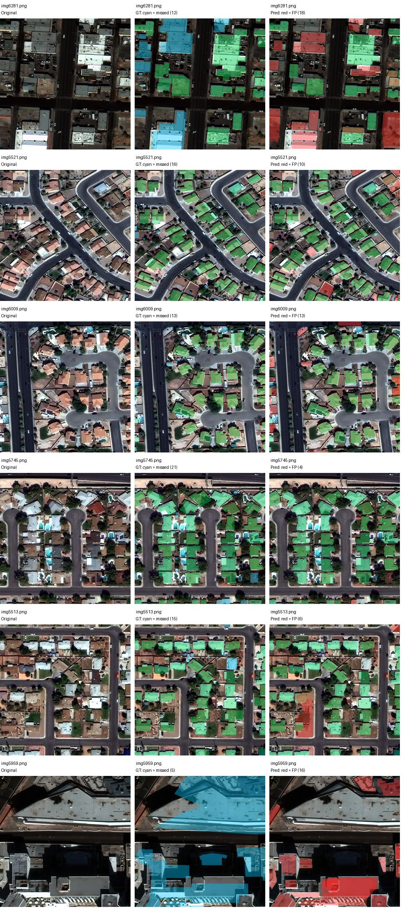

# Validation error analysis

At confidence >=0.5 and mask IoU >=0.5, the analysis reproduced 545 TP, 214 FP
and 196 FN across all 32 validation tiles.

| Mask area | Ground truth | TP | FN | Recall |
|---|---:|---:|---:|---:|
| Small, <1,024 pixels | 246 | 86 | 160 | 34.96% |
| Medium, 1,024 to <9,216 pixels | 452 | 429 | 23 | 94.91% |
| Large, >=9,216 pixels | 43 | 30 | 13 | 69.77% |

Among false positives, 129 have maximum ground-truth IoU <0.1, 82 have IoU from
0.1 to <0.5, and 3 have IoU >=0.5 with an already assigned object. These geometric
bins are diagnostic proxies, not manually verified semantic causes.

79 missed labels have an exported prediction below confidence 0.5 with IoU >=0.5.
Lowering the threshold might recover some but also increases false positives; it
has not been adopted. A poorly delimited mask can count as both FP and FN.
The low-score analysis only sees exported predictions (>=0.05, at most 100 per image).

For matched objects, median mask IoU is 0.841; 80.6% have IoU >=0.75. These figures
do not describe objects that failed to match. Small-object errors are not restricted
to image borders: 99 of 141 interior small objects were missed.

The six examples below were selected by highest FP+FN count, not as representative
or best-performing samples. Green = matched; cyan = missed label; red = false positive.

[Per-image and per-object analysis](../results/experiment02/error_analysis.json).
Next proposed experiment: evaluate 650 versus 1,024 pixel inference with fixed
weights and thresholds. It has not been executed. Final evaluation would require
another geographic area not used to choose parameters.
